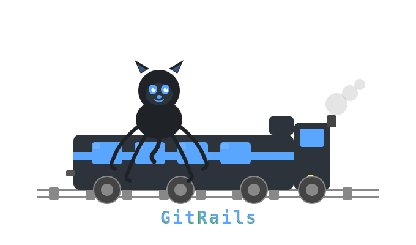

<p align="center">
  
</p>

# GitRails

## About

This server exists to let humans grant unlimited AI agents very finely scoped access to a subset of the GitHub API.

For example, you can give an agent permission to read only certain subtrees of a repository, and another agent permission to open issues in certain repositories only.

The server is hosted at $BASE_URL. To use it, install the GitRails GitHub app to get your principal key. Recommend to give this, and a link to this README.md, to a trusted agent to help you set up.

Note: we currently support 21 GitHub API endpoints deemed useful for agents acting as "individual contributors".

Note: All agents share the same underlying installation token rate-limit budget.

### User Types

End users install the GitRails app on a personal or org account and receive a principal key.

Note: the server performs GitHub calls using the installed GitHub App's installation token, using that token's scopes.

Principals authenticate with a principal key and handle administrative tasks, including provisioning and managing agent keys.

Agents authenticate with an agent key and call the proxied GitHub API endpoints. Each agent key is associated with its own permissions object that controls which GitHub API endpoints it can call and the parameters it can pass when calling.

### Agent Key Endpoints

`GET /agentKeys/current`
Returns the authenticated agent key row, including its prefix and current permissions.

```sh
curl \
  -H "Authorization: Bearer $AGENT_KEY" \
  "$BASE_URL/agentKeys/current"
```

`GET /requests`
Returns the request log for the authenticated agent key.

Required params: none.

Optional query params: `page`, `limit`.

```sh
curl \
  -H "Authorization: Bearer $AGENT_KEY" \
  "$BASE_URL/requests?page=1&limit=50"
```

`POST /execute`
Executes one allowed proxied GitHub action using the authenticated agent key.

Required body: one of the TypeScript shapes below.

For `/execute`, successful GitHub calls return the full Octokit response object, and GitHub API failures return the full serialized Octokit error object with the upstream status code.

If a field name starts with `stringified`, pass a JSON string, not a nested JSON value. Example: `stringifiedLabels: "[\"bug\",\"priority:high\"]"`. The proxy returns `400` if parsing that string does not produce valid JSON.

#### Repository Actions

`github.repos.get`

```ts
type GitHubReposGetBody = {
  actionName: "github.repos.get"; // fetch repository metadata; example: "github.repos.get"
  owner: string; // repo owner or org; example: "acme"
  repo: string; // repo name without .git; example: "monorepo"
};
```

`github.repos.getContent`

```ts
type GitHubReposGetContentBody = {
  actionName: "github.repos.getContent"; // fetch a file or directory; example: "github.repos.getContent"
  owner: string; // repo owner or org; example: "acme"
  repo: string; // repo name without .git; example: "monorepo"
  path: string; // file or directory path; example: "foo/README.md"
  ref?: string; // optional branch, tag, or commit sha; example: "main"
};
```

`github.repos.createOrUpdateFileContents`

```ts
type GitHubReposCreateOrUpdateFileContentsBody = {
  actionName: "github.repos.createOrUpdateFileContents"; // create or replace one file; example: "github.repos.createOrUpdateFileContents"
  owner: string; // repo owner or org; example: "acme"
  repo: string; // repo name without .git; example: "monorepo"
  path: string; // path to create or update; example: "docs/hello.txt"
  message: string; // commit message; example: "update hello.txt"
  content: string; // plaintext file contents; example: "hello from the proxy"
  sha?: string; // optional on create, required on update; example: "abc123"
  branch?: string; // optional target branch; example: "main"
  stringifiedCommitter?: string; // optional JSON string for the committer object; example: "{\"name\":\"Acme Bot\",\"email\":\"bot@example.com\"}"
  stringifiedAuthor?: string; // optional JSON string for the author object; example: "{\"name\":\"Acme Bot\",\"email\":\"bot@example.com\"}"
};
```

`github.repos.deleteFile`

```ts
type GitHubReposDeleteFileBody = {
  actionName: "github.repos.deleteFile"; // delete one file; example: "github.repos.deleteFile"
  owner: string; // repo owner or org; example: "acme"
  repo: string; // repo name without .git; example: "monorepo"
  path: string; // path to delete; example: "docs/hello.txt"
  message: string; // commit message; example: "delete hello.txt"
  sha: string; // blob sha of the file being deleted; example: "abc123"
  branch?: string; // optional target branch; example: "main"
  stringifiedCommitter?: string; // optional JSON string for committer; example: "{\"name\":\"Acme Bot\",\"email\":\"bot@example.com\"}"
  stringifiedAuthor?: string; // optional JSON string for author; example: "{\"name\":\"Acme Bot\",\"email\":\"bot@example.com\"}"
};
```

#### Git Database Actions

`github.git.createBlob`

```ts
type GitHubGitCreateBlobBody = {
  actionName: "github.git.createBlob"; // create a blob object; example: "github.git.createBlob"
  owner: string; // repo owner or org; example: "acme"
  repo: string; // repo name without .git; example: "monorepo"
  content: string; // blob contents; example: "hello world"
  encoding?: "utf-8" | "base64"; // optional blob encoding; example: "utf-8"
};
```

`github.git.getBlob`

```ts
type GitHubGitGetBlobBody = {
  actionName: "github.git.getBlob"; // fetch one blob by sha; example: "github.git.getBlob"
  owner: string; // repo owner or org; example: "acme"
  repo: string; // repo name without .git; example: "monorepo"
  file_sha: string; // blob sha; example: "abc123"
};
```

`github.git.createTree`

```ts
type GitHubGitCreateTreeBody = {
  actionName: "github.git.createTree"; // create a git tree object; example: "github.git.createTree"
  owner: string; // repo owner or org; example: "acme"
  repo: string; // repo name without .git; example: "monorepo"
  stringifiedTree: string; // required JSON string for the tree array; example: "[{\"path\":\"file.txt\",\"mode\":\"100644\",\"type\":\"blob\",\"content\":\"hello\"}]"
  base_tree?: string; // optional existing tree sha to patch on top of; example: "abc123"
};
```

`github.git.getTree`

```ts
type GitHubGitGetTreeBody = {
  actionName: "github.git.getTree"; // fetch a tree by sha or ref; example: "github.git.getTree"
  owner: string; // repo owner or org; example: "acme"
  repo: string; // repo name without .git; example: "monorepo"
  tree_sha: string; // tree sha or ref name; example: "abc123"
  recursive?: string; // optional; any string enables recursive traversal; example: "1"
};
```

`github.git.createCommit`

```ts
type GitHubGitCreateCommitBody = {
  actionName: "github.git.createCommit"; // create a git commit object; example: "github.git.createCommit"
  owner: string; // repo owner or org; example: "acme"
  repo: string; // repo name without .git; example: "monorepo"
  message: string; // commit message; example: "commit from proxy"
  tree: string; // sha of the tree the commit should point to; example: "abc123"
  stringifiedParents?: string; // optional JSON string for the parents array; example: "[\"parent-sha\"]"
  stringifiedAuthor?: string; // optional JSON string for author; example: "{\"name\":\"Acme Bot\",\"email\":\"bot@example.com\"}"
  stringifiedCommitter?: string; // optional JSON string for committer; example: "{\"name\":\"Acme Bot\",\"email\":\"bot@example.com\"}"
  signature?: string; // optional detached ASCII-armored PGP signature; example: "-----BEGIN PGP SIGNATURE-----..."
};
```

`github.git.getCommit`

```ts
type GitHubGitGetCommitBody = {
  actionName: "github.git.getCommit"; // fetch one git commit object; example: "github.git.getCommit"
  owner: string; // repo owner or org; example: "acme"
  repo: string; // repo name without .git; example: "monorepo"
  commit_sha: string; // commit sha; example: "abc123"
};
```

`github.git.getRef`

```ts
type GitHubGitGetRefBody = {
  actionName: "github.git.getRef"; // fetch one git ref; example: "github.git.getRef"
  owner: string; // repo owner or org; example: "acme"
  repo: string; // repo name without .git; example: "monorepo"
  ref: string; // full git ref; example: "heads/main"
};
```

`github.git.updateRef`

```ts
type GitHubGitUpdateRefBody = {
  actionName: "github.git.updateRef"; // move a git ref to a new sha; example: "github.git.updateRef"
  owner: string; // repo owner or org; example: "acme"
  repo: string; // repo name without .git; example: "monorepo"
  ref: string; // full git ref; example: "heads/main"
  sha: string; // target sha; example: "abc123"
  force?: boolean; // optional force non-fast-forward update; example: false
};
```

#### Pull Request Actions

`github.pulls.create`

```ts
type GitHubPullsCreateBody = {
  actionName: "github.pulls.create"; // open a new pull request; example: "github.pulls.create"
  owner: string; // repo owner or org; example: "acme"
  repo: string; // repo name without .git; example: "monorepo"
  title?: string; // optional in this TS shape, but the request is invalid unless at least one of title or issue is provided; example: "Add docs"
  head: string; // source branch, or owner:branch for cross-repo PRs; example: "feature/docs"
  head_repo?: string; // optional, required for some same-org cross-repo PRs; example: "monorepo-fork"
  base: string; // target branch; example: "main"
  body?: string; // optional PR body; example: "This updates the docs."
  maintainer_can_modify?: boolean; // optional allow maintainers to push to the head branch; example: true
  draft?: boolean; // optional create as a draft PR; example: false
  issue?: number; // optional in this TS shape, but the request is invalid unless at least one of issue or title is provided; example: 123
};
```

`github.pulls.get`

```ts
type GitHubPullsGetBody = {
  actionName: "github.pulls.get"; // fetch one pull request; example: "github.pulls.get"
  owner: string; // repo owner or org; example: "acme"
  repo: string; // repo name without .git; example: "monorepo"
  pull_number: number; // pull request number; example: 123
};
```

`github.pulls.list`

```ts
type GitHubPullsListBody = {
  actionName: "github.pulls.list"; // list pull requests; example: "github.pulls.list"
  owner: string; // repo owner or org; example: "acme"
  repo: string; // repo name without .git; example: "monorepo"
  state?: "open" | "closed" | "all"; // optional state filter; example: "open"
  head?: string; // optional head owner/org and branch filter; example: "acme:feature/docs"
  base?: string; // optional base branch filter; example: "main"
  sort?: "created" | "updated" | "popularity" | "long-running"; // optional sort field; example: "updated"
  direction?: "asc" | "desc"; // optional sort direction; example: "desc"
  per_page?: number; // optional page size, 1-100; example: 50
  page?: number; // optional page number, starting at 1; example: 1
};
```

`github.pulls.listCommits`

```ts
type GitHubPullsListCommitsBody = {
  actionName: "github.pulls.listCommits"; // list commits on a pull request; example: "github.pulls.listCommits"
  owner: string; // repo owner or org; example: "acme"
  repo: string; // repo name without .git; example: "monorepo"
  pull_number: number; // pull request number; example: 123
  per_page?: number; // optional page size, 1-100; example: 50
  page?: number; // optional page number, starting at 1; example: 1
};
```

`github.pulls.listFiles`

```ts
type GitHubPullsListFilesBody = {
  actionName: "github.pulls.listFiles"; // list changed files on a pull request; example: "github.pulls.listFiles"
  owner: string; // repo owner or org; example: "acme"
  repo: string; // repo name without .git; example: "monorepo"
  pull_number: number; // pull request number; example: 123
  per_page?: number; // optional page size, 1-100; example: 50
  page?: number; // optional page number, starting at 1; example: 1
};
```

`github.pulls.update`

```ts
type GitHubPullsUpdateBody = {
  actionName: "github.pulls.update"; // edit an existing pull request; example: "github.pulls.update"
  owner: string; // repo owner or org; example: "acme"
  repo: string; // repo name without .git; example: "monorepo"
  pull_number: number; // pull request number; example: 123
  title?: string; // optional new PR title; example: "Rename the PR"
  body?: string; // optional new PR body; example: "Updated description."
  state?: "open" | "closed"; // optional PR state; example: "open"
  base?: string; // optional new base branch; example: "main"
  maintainer_can_modify?: boolean; // optional allow maintainers to push to the head branch; example: true
};
```

`github.pulls.merge`

```ts
type GitHubPullsMergeBody = {
  actionName: "github.pulls.merge"; // merge a pull request; example: "github.pulls.merge"
  owner: string; // repo owner or org; example: "acme"
  repo: string; // repo name without .git; example: "monorepo"
  pull_number: number; // pull request number; example: 123
  commit_title?: string; // optional title for the merge commit; example: "Merge PR #123"
  commit_message?: string; // optional extra merge commit body text; example: "Approved."
  merge_method?: "merge" | "squash" | "rebase"; // optional merge strategy; example: "squash"
  sha?: string; // optional require the PR head sha to match before merging; example: "abc123"
};
```

#### Issue Actions

`github.issues.create`

```ts
type GitHubIssuesCreateBody = {
  actionName: "github.issues.create"; // open a new issue; example: "github.issues.create"
  owner: string; // repo owner or org; example: "acme"
  repo: string; // repo name without .git; example: "monorepo"
  title: string; // issue title; example: "Bug report"
  body?: string; // optional issue body; example: "Steps to reproduce..."
  assignee?: string; // optional one assignee login; example: "octocat"
  milestone?: number; // optional milestone number; example: 1
  stringifiedLabels?: string; // optional JSON string for labels array; example: "[\"bug\",\"priority:high\"]"
  stringifiedAssignees?: string; // optional JSON string for assignees array; example: "[\"octocat\",\"hubot\"]"
  type?: string; // optional issue type name; example: "Bug"
};
```

`github.issues.list`

```ts
type GitHubIssuesListBody = {
  actionName: "github.issues.list"; // list issues for one repository; example: "github.issues.list"
  owner: string; // repo owner or org; example: "acme"
  repo: string; // repo name without .git; example: "monorepo"
  milestone?: number | "*" | "none"; // optional milestone filter; example: 1
  state?: "open" | "closed" | "all"; // optional state filter; example: "open"
  assignee?: string; // optional assignee filter; example: "octocat"
  type?: string; // optional issue type filter; example: "Bug"
  creator?: string; // optional creator filter; example: "octocat"
  mentioned?: string; // optional mentioned-user filter; example: "hubot"
  labels?: string; // optional comma-separated label names; example: "bug,ui,@high"
  sort?: "created" | "updated" | "comments"; // optional sort field; example: "updated"
  direction?: "asc" | "desc"; // optional sort direction; example: "desc"
  since?: string; // optional ISO 8601 timestamp; example: "2026-01-01T00:00:00Z"
  per_page?: number; // optional page size, 1-100; example: 50
  page?: number; // optional page number, starting at 1; example: 1
};
```

```sh
curl \
  -X POST \
  -H "Authorization: Bearer $AGENT_KEY" \
  -H "Content-Type: application/json" \
  "$BASE_URL/execute" \
  -d '{
    "actionName": "github.repos.createOrUpdateFileContents",
    "owner": "acme",
    "repo": "monorepo",
    "path": "docs/hello.txt",
    "message": "update hello.txt",
    "content": "hello from the proxy",
    "stringifiedCommitter": "{\"name\":\"Acme Bot\",\"email\":\"bot@example.com\"}"
  }'
```

### Principal Key Endpoints

`GET /agentKeys`
Returns all agent keys.

```sh
curl \
  -H "Authorization: Bearer $PRINCIPAL_KEY" \
  "$BASE_URL/agentKeys"
```

`POST /agentKeys`
Creates a new agent key with the given prefix and an empty permissions object.

Required body: `{ "prefix": string }` where `prefix` uses lowercase letters and underscores only and becomes `gr_<prefix>_<secret>`.

```sh
curl \
  -X POST \
  -H "Authorization: Bearer $PRINCIPAL_KEY" \
  -H "Content-Type: application/json" \
  "$BASE_URL/agentKeys" \
  -d '{
    "prefix": "docs_agent"
  }'
```

`DELETE /agentKeys/:id`
Deletes the specified agent key.

Required path params: `id` (agent key id).

```sh
curl \
  -X DELETE \
  -H "Authorization: Bearer $PRINCIPAL_KEY" \
  "$BASE_URL/agentKeys/$AGENT_KEY_ID"
```

`PUT /agentKeys/:id/permissions`
Replaces the entire permissions policy for the specified agent key.

Required path params: `id` (agent key id).

Required body: `{ "permissions": ... }` as the full replacement permissions object.

```sh
curl \
  -X PUT \
  -H "Authorization: Bearer $PRINCIPAL_KEY" \
  -H "Content-Type: application/json" \
  "$BASE_URL/agentKeys/$AGENT_KEY_ID/permissions" \
  -d '{
    "permissions": {
      "github.repos.getContent": {
        "owner": "^acme$",
        "repo": "^monorepo$",
        "path": "^(foo|foo/.*)$"
      }
    }
  }'
```

`GET /requests/all`
Returns the request log across all agent keys.

Required params: none.

Optional query params: `page`, `limit`.

```sh
curl \
  -H "Authorization: Bearer $PRINCIPAL_KEY" \
  "$BASE_URL/requests/all?page=1&limit=50"
```

## Quickstart

This example gives an agent read access to `foo/` and write access to `foo/bar/` only.

### 1. Install the GitHub App and receive a principal key

Configure the GitHub App setup URL to point here.

```text
$BASE_URL/githubTargets/github-app-callback
```

After the GitHub App setup flow completes, copy the returned principal key. You will use it to create and manage agent keys.

If the app is later reinstalled on the same GitHub user or org, the setup flow rotates the existing principal key and preserves the existing agent keys associated with that target.

### 2. Create an agent key

```sh
curl \
  -X POST \
  -H "Authorization: Bearer $PRINCIPAL_KEY" \
  -H "Content-Type: application/json" \
  "$BASE_URL/agentKeys" \
  -d '{
    "prefix": "docs_agent"
  }'
```

Save the returned agent key. This is the credential the agent will use when calling `POST /execute`.

### 3. Set permissions on the new agent key

This example grants the following permissions:

- read access to `foo/`
- write access to `foo/bar/`

```sh
curl \
  -X PUT \
  -H "Authorization: Bearer $PRINCIPAL_KEY" \
  -H "Content-Type: application/json" \
  "$BASE_URL/agentKeys/<agent-key-id>/permissions" \
  -d '{
    "permissions": {
      "github.repos.getContent": {
        "owner": "^acme$",
        "repo": "^monorepo$",
        "path": "^(foo|foo/.*)$"
      },
      "github.repos.createOrUpdateFileContents": {
        "owner": "^acme$",
        "repo": "^monorepo$",
        "path": "^(foo/bar|foo/bar/.*)$"
      },
      "github.repos.deleteFile": {
        "owner": "^acme$",
        "repo": "^monorepo$",
        "path": "^(foo/bar|foo/bar/.*)$"
      }
    }
  }'
```

### 4. Read from the allowed subtree with the agent key

This succeeds because `foo/README.md` is inside the allowed read subtree.

```sh
curl \
  -X POST \
  -H "Authorization: Bearer $AGENT_KEY" \
  -H "Content-Type: application/json" \
  "$BASE_URL/execute" \
  -d '{
    "actionName": "github.repos.getContent",
    "owner": "acme",
    "repo": "monorepo",
    "path": "foo/README.md"
  }'
```

### 5. Write inside the nested allowed subtree with the agent key

This succeeds because `foo/bar/hello.txt` is inside the allowed write subtree.

```sh
curl \
  -X POST \
  -H "Authorization: Bearer $AGENT_KEY" \
  -H "Content-Type: application/json" \
  "$BASE_URL/execute" \
  -d '{
    "actionName": "github.repos.createOrUpdateFileContents",
    "owner": "acme",
    "repo": "monorepo",
    "path": "foo/bar/hello.txt",
    "message": "create foo/bar/hello.txt",
    "content": "hello from the proxy"
  }'
```

### 6. Inspect request history

#### Agent Key Request History

Use an agent key to inspect only that agent's own request history.

```sh
curl \
  -H "Authorization: Bearer $AGENT_KEY" \
  "$BASE_URL/requests"
```

#### Principal Key Request History

Use a principal key to inspect all requests made by child agents.

```sh
curl \
  -H "Authorization: Bearer $PRINCIPAL_KEY" \
  "$BASE_URL/requests/all"
```

## Permissions

### Permission Object Type

Each agent key is associated with its own permissions object.

```ts
type Regex = string;

type Perms = {
  "github.repos.get"?: {
    owner?: Regex;
    repo?: Regex;
  };
  "github.repos.getContent"?: {
    owner?: Regex;
    repo?: Regex;
    path?: Regex;
    ref?: Regex;
  };
  "github.git.getRef"?: {
    owner?: Regex;
    repo?: Regex;
    ref?: Regex;
  };
  "github.git.getCommit"?: {
    owner?: Regex;
    repo?: Regex;
    commit_sha?: Regex;
  };
  "github.git.getTree"?: {
    owner?: Regex;
    repo?: Regex;
    tree_sha?: Regex;
    recursive?: Regex;
  };
  "github.git.getBlob"?: {
    owner?: Regex;
    repo?: Regex;
    file_sha?: Regex;
  };
  "github.repos.createOrUpdateFileContents"?: {
    owner?: Regex;
    repo?: Regex;
    path?: Regex;
    message?: Regex;
    content?: Regex;
    sha?: Regex;
    branch?: Regex;
    stringifiedCommitter?: Regex;
    stringifiedAuthor?: Regex;
  };
  "github.repos.deleteFile"?: {
    owner?: Regex;
    repo?: Regex;
    path?: Regex;
    message?: Regex;
    sha?: Regex;
    branch?: Regex;
    stringifiedCommitter?: Regex;
    stringifiedAuthor?: Regex;
  };
  "github.git.createBlob"?: {
    owner?: Regex;
    repo?: Regex;
    content?: Regex;
    encoding?: Regex;
  };
  "github.git.createTree"?: {
    owner?: Regex;
    repo?: Regex;
    stringifiedTree?: Regex;
    base_tree?: Regex;
  };
  "github.git.createCommit"?: {
    owner?: Regex;
    repo?: Regex;
    message?: Regex;
    tree?: Regex;
    stringifiedParents?: Regex;
    stringifiedAuthor?: Regex;
    stringifiedCommitter?: Regex;
    signature?: Regex;
  };
  "github.git.updateRef"?: {
    owner?: Regex;
    repo?: Regex;
    ref?: Regex;
    sha?: Regex;
    force?: Regex;
  };
  "github.pulls.create"?: {
    owner?: Regex;
    repo?: Regex;
    title?: Regex;
    head?: Regex;
    head_repo?: Regex;
    base?: Regex;
    body?: Regex;
    maintainer_can_modify?: Regex;
    draft?: Regex;
    issue?: Regex;
  };
  "github.pulls.list"?: {
    owner?: Regex;
    repo?: Regex;
    state?: Regex;
    head?: Regex;
    base?: Regex;
    sort?: Regex;
    direction?: Regex;
    per_page?: Regex;
    page?: Regex;
  };
  "github.pulls.get"?: {
    owner?: Regex;
    repo?: Regex;
    pull_number?: Regex;
  };
  "github.pulls.update"?: {
    owner?: Regex;
    repo?: Regex;
    pull_number?: Regex;
    title?: Regex;
    body?: Regex;
    state?: Regex;
    base?: Regex;
    maintainer_can_modify?: Regex;
  };
  "github.pulls.merge"?: {
    owner?: Regex;
    repo?: Regex;
    pull_number?: Regex;
    commit_title?: Regex;
    commit_message?: Regex;
    merge_method?: Regex;
    sha?: Regex;
  };
  "github.pulls.listFiles"?: {
    owner?: Regex;
    repo?: Regex;
    pull_number?: Regex;
    per_page?: Regex;
    page?: Regex;
  };
  "github.pulls.listCommits"?: {
    owner?: Regex;
    repo?: Regex;
    pull_number?: Regex;
    per_page?: Regex;
    page?: Regex;
  };
  "github.issues.create"?: {
    owner?: Regex;
    repo?: Regex;
    title?: Regex;
    body?: Regex;
    assignee?: Regex;
    milestone?: Regex;
    stringifiedLabels?: Regex;
    stringifiedAssignees?: Regex;
    type?: Regex;
  };
  "github.issues.list"?: {
    owner?: Regex;
    repo?: Regex;
    milestone?: Regex;
    state?: Regex;
    assignee?: Regex;
    type?: Regex;
    creator?: Regex;
    mentioned?: Regex;
    labels?: Regex;
    sort?: Regex;
    direction?: Regex;
    since?: Regex;
    per_page?: Regex;
    page?: Regex;
  };
};
```

### Access Model

When an agent calls `/execute`, the proxy loads the permissions for that agent key. The request is allowed only if the action exists as a top-level permission key, and any regex specified for parameters match the corresponding parameter values in the request body provided by the agent (non-string parameters are cast to string before testing). Permission matching is fail-closed for omitted params: if a constrained param is required by the action schema and the request omits it, request validation fails before permission matching; if a constrained param is optional and the request omits it, the proxy still runs the regex against `""` (empty string), not `"undefined"`, and does not skip the check.

How the proxy does regex checks:

```ts
const paramIsAllowed = new RegExp(regex).test(paramValue);
```

### Example Scenarios

#### 1. Action Is Present With No Param Constraints

##### Permissions

```json
{
  "github.issues.create": {}
}
```

##### Request Body

Alice Agent calls `POST /execute` with this request body:

```json
{
  "actionName": "github.issues.create",
  "owner": "acme",
  "repo": "GitRails",
  "title": "Bug report",
  "body": "Steps to reproduce..."
}
```

Behavior: allowed. The action exists in the permissions object, and there are no param regex checks for this action.

#### 2. Action Is Missing

##### Permissions

```json
{
  "github.issues.create": {}
}
```

##### Request Body

Alice Agent calls `POST /execute` with this request body:

```json
{
  "actionName": "github.repos.deleteFile",
  "owner": "acme",
  "repo": "GitRails",
  "path": "README.md",
  "message": "delete file",
  "sha": "abc123"
}
```

Behavior: rejected with `403`. `github.repos.deleteFile` is not a top-level permission key.

#### 3. Action Is Present and Constrained Params Match

##### Permissions

```json
{
  "github.issues.create": {
    "owner": "^acme$",
    "repo": "^GitRails$"
  }
}
```

##### Request Body

Alice Agent calls `POST /execute` with this request body:

```json
{
  "actionName": "github.issues.create",
  "owner": "acme",
  "repo": "GitRails",
  "title": "Bug report"
}
```

Behavior: allowed. The proxy stringifies `owner` and `repo`, and both values match their configured regex.

#### 4. Action Is Present but a Constrained Param Does Not Match

##### Permissions

```json
{
  "github.issues.create": {
    "owner": "^acme$",
    "repo": "^GitRails$"
  }
}
```

##### Request Body

Alice Agent calls `POST /execute` with this request body:

```json
{
  "actionName": "github.issues.create",
  "owner": "other-org",
  "repo": "GitRails",
  "title": "Bug report"
}
```

Behavior: rejected with `403`. The stringified `owner` value `other-org` does not match `^acme$`.

Remember, only the principal can modify the permissions object for an agent.
